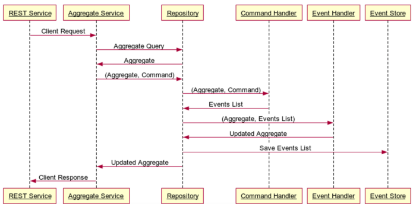

# Event Source

Event Sourcing is an architectural pattern that is resurfacing lately as a valuable component of a modern distributed microservices ecosystem. [Martin Fowler](https://martinfowler.com/eaaDev/EventSourcing.html) describes the basic pattern as follows: “_The fundamental idea of Event Sourcing is that of ensuring every change to the state of an application is captured in an event object, and that these event objects are themselves stored in the sequence they were applied for the same lifetime as the application state itself._”

In short, Event Sourcing is an architectural pattern that maintains a complete transaction history for a data model. Instead of persisting the data model itself, you persist the events that lead to a change in the data. These events are then played in order, building up an aggregate view of the complete data domain. The ability to replay events to any point in time is also an excellent debugging tool that enables us to easily explain why a member’s account is in a particular state and allows us to easily test system variations.

## The Pattern
The following diagram provides a high-level view of how we applied the Event Sourcing pattern for the Netflix system responsible for enforcing the downloads business rules, with a generic explanation of each component following.

The Event Sourcing pattern depends upon three different service layers: commands, events & aggregates.
 * A **Command** represents the client request to change the state of the Aggregate. The Command is used by the Command Handler to determine how to create a list of Events needed to satisfy the Command.
 * An **Event** is an immutable representation of a change of state for the Aggregate, i.e., the action taken to change the state. Events are always represented in the past tense.
 * An **Aggregate** is the aggregated representation of the current state of the domain model. The Aggregate takes a stream of events and determines how to represent the aggregated data for the requested business logic purpose.

As shown, there are a number of actors involved in implementing the pattern.

 * The **REST Service** is the application layer that accepts requests from the client and passes them on to the Aggregate Service.
 * The **Aggregate Service** handles client requests. The Aggregate Service queries for existing Aggregates and if one does not exist, can create an empty Aggregate. The Aggregate Service then generates the Command associated with the request and passes the Command, along with the Aggregate, to the Command Handler.
 * The **Command Handler** takes the Aggregate and the Command and assesses, based on state transition validity checks, whether or not the Command can be applied to the Aggregate in its current state. If the state transition is valid, the Command Handler creates an Event and passes the Event and Aggregate to the Event Handler.
 * The **Event Handler** applies the Events to the Aggregate, resulting in a new Aggregate state, and passes the list of Events to the Repository Service.
 * The **Repository Service** manages state by applying the newly created Events to the Aggregate. The events are then saved to the Event Store, resulting in the new state of the Aggregate to be available in our system.
 * The **Event Store** is an abstracted interaction for event read/write functionality with the backing database.
